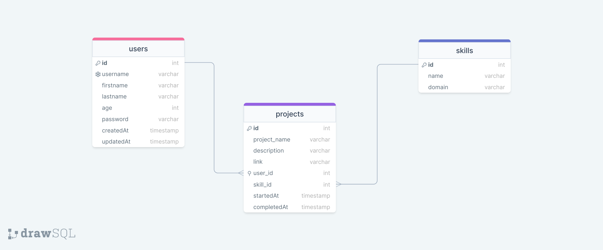
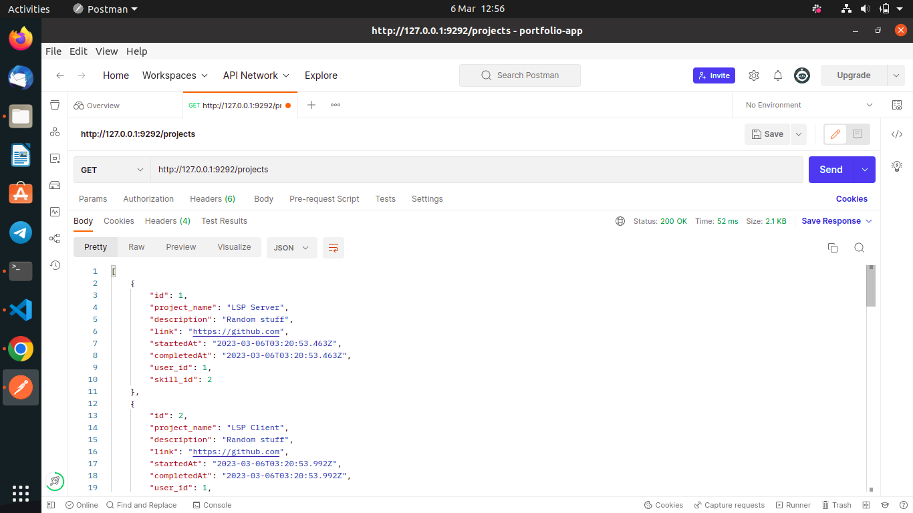

# Porfolio App
This is an application that will provide a platform for a professional to manage their online portfolio.

## Description
A portfolio is a professional’s most important tool. This app attempts to provide a platform for professionals to manage their online portfolios. This is the sinatra backend of the application.

I have three models in this application, `User`, `Project`, and `Skill`. The models are all related to each other.

- `User` - `Project`: This is a one-to-many relationship where an instance of `User` can have many projects(instances of `Project`), but a specific project can only belong to one user.
- `Skill` - `Project`: This is a is a one-to-many relationship where an instance of `Skill` can be used on many projects (instances of `Project`), but a specific project can have zero or one `Skill` (for simplicity).
- `User` - `Skill`: This is a many-to-many relationship where an instance of `User` can have one or more skills and an instance of `Skill` can have one or many users using them.

The Entity-Relationship Diagram below tries to represent these relationships detailed above:

## Getting Started
### Setup Requirements
- Operating System: Any UNIX based Operating System should suffice.
- Ruby installed on your system(version 2.7.3 and above).
- Code editor/IDE to view and/or contribute to the project(preferably VScode or RubyMine IDE).
- Git installed on your system.

### Setup
To clone this repository in your PC, run:

        git clone git@github.com:Samueelx/portfolio-app.git

`cd` into the project directory and run this command to download the necessary gems/dependencies:

        bundle install

## Running the program
### Migrate the database
For this application to run, you first need to set up the database schema. To do so, you need to run a migration. Use this command to run the migration(at the root of the project direcory):

        bundle exec rake db:migrate

Then, populate the database tables with sample data using the following command (at the root of the project direcory):

        bundle exec rake db:seed 

### Executing the program
You can test out the endpoints exposed by this app using [Postman](https://www.postman.com/) or the [Thinder Client Extension](https://www.thunderclient.com/) if you're using Visual Studio Code.

Screenshot from postman:

The endpoints have been defined in the ruby files located in `./app/controllers/` directory.

## Authors
[Samuel Gitimu](https://github.com/Samueelx)

## License
This project is licensed under the [MIT](https://github.com/Samueelx/portfolio-app/blob/master/LICENSE) licence.